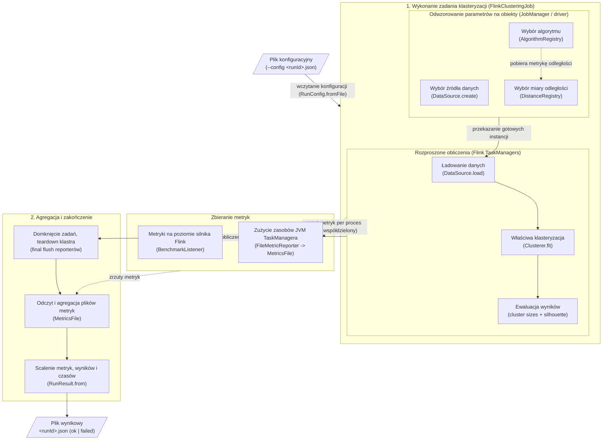

# flink-clustering-algorithms

Part of the Master thesis 'Performance and efficiency issues of the use of Big Data frameworks for implementation of clustering algorithms'.

## Table of contents
* [General info](#general-info)
* [Architecture](#architecture)
* [Project structure](#project-structure)
* [Requirements](#requirements)
* [Usage](#usage)
* [Contract](#contract)


## General info

From-scratch **Java / Flink** implementations of clustering algorithms, plus the
Flink side of the benchmarking framework. Builds a self-contained fat jar that runs
**one config in, one result out**.

This repo owns only the algorithms and the Flink job. Experiment orchestration (matrix
expansion, SLURM submission), the exchange **contract**, and result analysis are
engine-agnostic and live in the shared repo: [`clustering-algorithms-benchmark`](https://github.com/natix-x/clustering-algorithms-benchmark).

It is the Flink counterpart of the Scala
[`spark-clustering-algorithms`](https://github.com/natix-x/spark-clustering-algorithms)
repo and deliberately mirrors its package layout
(`clustering.core / distance / algorithms / evaluation` +
`clustering.benchmark.{config,datasource,evaluation,metrics,registry}`), so the two
engines are directly comparable. Flink is implemented in **Java, not Scala**: Flink's
first-class API is Java (the Scala DataStream/DataSet API was deprecated in Flink 1.15
and removed in Flink 2.0), and `flink-ml` has no Scala API — so Java is the honest,
future-proof choice and does not affect the JVM-level metrics being compared.

> **Note:** Some documentation and diagrams are in Polish, as the master thesis they accompany is written in Polish.

Implemented algorithms:
TODO: ADD DESCRIPTIONS/DIAGRAMS/WHAT CAN BE CONFIGURED HERE


## Architecture

`BenchmarkRunner` consumes exactly one per-run JSON config and produces exactly one JSON
result file under `<outputDir>/<runId>.json`. Failure modes still write a result
(`status: "failed"` + `errorMessage`) and exit non-zero, so SLURM array jobs never
silently lose runs.



The pipeline is assembled from config strings by two registries plus a data-source
factory, so adding an algorithm, data source, or metric is one factory entry — the
runner never changes:

- **`AlgorithmRegistry`** — `config.algorithm.name` → `Clusterer` factory
  (kmeans / pam / fastpam / distpam / distfastpam / clara / claraflip).
- **`DataSource.create`** — `config.dataset.type` → `DataSource` (synthetic).
- **`DistanceRegistry`** — `params.distance` → `DistanceMetric` (Euclidean).

Core abstractions (`clustering.core`) keep algorithms uniform:

- `Clusterer.fit(PointSource, EnvFactory, parallelism): Model` — the fitting seam every
  algorithm implements. `EnvFactory` hands out fresh Flink `StreamExecutionEnvironment`s
  so each Flink action runs on a clean env.
- `Model.predict(double[]): int` / `Model.labels(List<double[]>): int[]` — assign each
  point to a cluster id. Batch-only by design.

`FlinkClusteringJob` wires these together for one run: load the `DataSource`, `fit` the
`Clusterer`, evaluate the `Model` (distributed cluster sizes + sampled silhouette), and
collect metrics into a `RunResult`.

### KMeans on the Flink ML iteration framework

**KMeans** is built on the **Flink ML bounded-iteration framework** (FLIP-176): the
algorithm is ours (init / assignment / mean update / empty-cluster handling), only the
iteration runtime is Flink ML's. Centroids cycle through a feedback edge, so the whole
training is ONE Flink job (cluster-friendly).

- **Distributed:** each round, a parallel `PartialAssign` (per-subtask partial sums +
  counts) feeds a single-task `CombinePartials` (merges k-sized partials into the new
  centroids). The distance work scales with parallelism, like Spark.
- **Memory-safe:** `PartialAssign` caches its local points in a `ListStateWithCache`
  (memory + disk spill, same as flink-ml's KMeans), so datasets larger than worker heap
  don't OOM.
- **Early termination:** `CombinePartials` checks centroid movement and emits a custom
  termination criterion — the iteration stops on convergence (max move < `eps`) or after
  `maxIter`, whichever comes first.
- **Deterministic & reproducible:** initial centroids come from a deterministic head
  sample (first points by index, collected at parallelism 1), so the same config + seed
  gives the same result regardless of compute parallelism. Only tiny init/silhouette
  samples run at parallelism 1; the heavy fit/count/sizes jobs run at full parallelism.

> **ENGINE metric fields** (shuffle / GC / task counters) are aggregated from the custom
> `FileMetricReporter` per-process dumps; see `BenchmarkListener` and `MetricsFile` for
> what is wired. Cluster submission (fresh-cluster-per-run, shared metrics path, reporter
> jar install) lives in the harness repo — see its README's "Flink one-time setup on Ares".

## Project structure
```
.
├── flink/                        # Java/Flink Maven project (the fat jar)
│   ├── pom.xml                   # Java/Flink build, shade into a fat jar
│   ├── src/main/java/clustering/
│   │   ├── core/                 # Clusterer / Model abstractions, EnvFactory, PointSource
│   │   ├── algorithms/           # clustering algorithms implementations
│   │   ├── distance/             # Euclidean metric
│   │   ├── evaluation/           # clustering metrics (silhouette)
│   │   ├── metrics/              # custom FileMetricReporter (engine metrics)
│   │   └── benchmark/            # runner (--config) + config, datasource, evaluation, metrics, registry
│   └── ...
├── local_run.sh                  # run a single config locally on an embedded MiniCluster
├── local_testing/                # JSON configs for local single-run testing
└── benchmark-results/            # local run outputs (one JSON result per run)
```

## Requirements

* JDK 11 (build with JDK 17 locally; Flink 1.17 does not support JDK 21)
* Maven (with `maven-shade-plugin`)
* Apache Flink 1.17.1 + Flink ML 2.3.0

## Usage

Build the fat jar:
```bash
cd flink
mvn clean package   # -> target/flink-clustering-benchmark.jar (runs the local MiniCluster test)
```

Run a single benchmark locally (from repo root):
```bash
./local_run.sh local_testing/experiment_configs/example.json
```

`local_run.sh` submits one config on an embedded Flink MiniCluster (via Maven, using the
test classpath — no Flink install needed) and writes the result to `benchmark-results/`.
Each config (dataset, algorithm, evaluation, cluster profile) conforms to
`run_config.schema.json` in the harness repo. Running on a real Ares/PLGrid cluster
(matrix expansion + SLURM submission) is owned by the harness repo
[`clustering-algorithms-benchmark`](https://github.com/natix-x/clustering-algorithms-benchmark).

## Contract

The JSON exchanged between the repos is defined by
[`contract/README.md`](https://github.com/natix-x/clustering-algorithms-benchmark/blob/main/contract/README.md)
in the harness repo. This jar **consumes** `run_config.schema.json` (via
`--config <runId>.json`) and **produces** `run_result.schema.json`, so analysis is
uniform across engines.

`FlinkClusteringJobTest` runs a real `FlinkClusteringJob` end-to-end on a tiny synthetic
dataset on a local MiniCluster and asserts the emitted `RunResult` — an `ok` run and a
`failed` run (unknown algorithm) — so the contract shape is exercised on every build.

```bash
cd flink
mvn test                 # end-to-end smoke test (FlinkClusteringJobTest)
```
