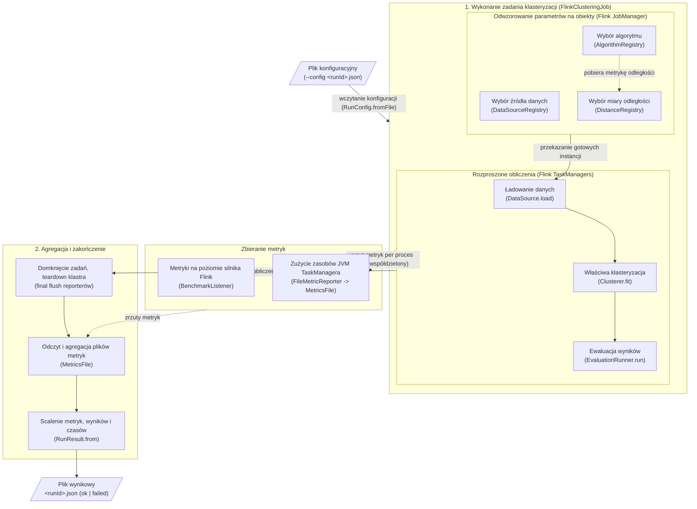

# flink-clustering-algorithms

Part of the Master thesis 'Performance and efficiency issues of the use of Big Data frameworks for implementation of clustering algorithms'.

## Table of contents
* [General info](#general-info)
* [Architecture](#architecture)
* [Project structure](#project-structure)
* [Requirements](#requirements)
* [Usage](#usage)
* [Contract](#contract)


## General info

From-scratch **Java / Flink** implementations of clustering algorithms, plus the
Flink side of the benchmarking framework. Builds a self-contained fat jar that runs
**one config in, one result out**.

This repo owns only the algorithms and the Flink job. Experiment orchestration (matrix
expansion, SLURM submission), the exchange **contract**, and result analysis are
engine-agnostic and live in the shared repo: [`clustering-algorithms-benchmark`](https://github.com/natix-x/clustering-algorithms-benchmark).

> **Note:** Some documentation and diagrams are in Polish, as the master thesis they accompany is written in Polish.

## Implemented algorithms

Registry name (`config.algorithm.name`) → factory in
[`AlgorithmRegistry.java`](flink/src/main/java/clustering/benchmark/registry/AlgorithmRegistry.java):

- **`kmeans`** — Lloyd's k-means, `geometry: euclidean|spherical`, `refine: none|breathing`.
  [`KMeans.java`](flink/src/main/java/clustering/algorithms/kmeans/KMeans.java) ·
  [`BreathingKMeans.java`](flink/src/main/java/clustering/algorithms/kmeans/BreathingKMeans.java) ·
  [`CentroidIteration.java`](flink/src/main/java/clustering/algorithms/kmeans/CentroidIteration.java)
- **`bisectingkmeans`** — divisive 2-means tree.
  [`BisectingKMeans.java`](flink/src/main/java/clustering/algorithms/kmeans/hierarchical/BisectingKMeans.java)
- **`fastpam` / `fasterpam`** — driver-local k-medoids: FastPAM1's exact swap and FasterPAM's eager swap.
  [`FastPAM.java`](flink/src/main/java/clustering/algorithms/kmedoids/local/FastPAM.java) ·
  [`FasterPAM.java`](flink/src/main/java/clustering/algorithms/kmedoids/local/FasterPAM.java)
- **`distfastpam`** — distributed FastPAM1 k-medoids, one FLIP-176 job.
  [`DistributedFastPAM.java`](flink/src/main/java/clustering/algorithms/kmedoids/distributed/DistributedFastPAM.java)
- **`clara`** — PAM over random samples, `inner: fastpam|fasterpam`.
  [`CLARA.java`](flink/src/main/java/clustering/algorithms/kmedoids/hybrid/CLARA.java) ·
  [`MedoidSearch.java`](flink/src/main/java/clustering/algorithms/kmedoids/hybrid/MedoidSearch.java)
- **`pamae`** — CLARA seeding + distributed Voronoi refinement (PAMAE, KDD 2017).
  [`PAMAE.java`](flink/src/main/java/clustering/algorithms/kmedoids/hybrid/PAMAE.java)
- **`dbscanpp`** (exact classic DBSCAN at `coreSampleFraction: 1.0` — no separate registry
  entry) — DBSCAN++, ε-neighbour counting + ε-graph, driver-local union-find.
  [`DBSCANpp.java`](flink/src/main/java/clustering/algorithms/dbscan/DBSCANpp.java)

Evaluation metrics (`config.evaluation.metrics`):
[`SilhouetteEvaluator.java`](flink/src/main/java/clustering/evaluation/SilhouetteEvaluator.java) ·
[`DaviesBouldinEvaluator.java`](flink/src/main/java/clustering/evaluation/DaviesBouldinEvaluator.java) ·
[`CalinskiHarabaszEvaluator.java`](flink/src/main/java/clustering/evaluation/CalinskiHarabaszEvaluator.java)

The k-means family takes no `distance`: the centroid update is an arithmetic mean, which is
only geometry-consistent under its own geometry's metric, so `geometry` fixes the metric
(euclidean → L2, spherical → cosine on the unit sphere). Evaluation then reuses that metric.

Point weights are supported here as on the Spark side: the stream record is a `WeightedPoint`
(coordinates + weight) and `ParquetDataSource` fills the weight from an optional `weightColumn`,
defaulting to 1.0 when the config names none — so an unweighted run is exactly the unit-weight
weighted run, and old configs are unaffected. Every algorithm honours it (k-means' weighted mean,
the medoid ladder's weighted Δ and cost, DBSCAN++'s `minPts` as a MASS threshold), and the
invariant "weighting == duplication" is pinned by `WeightedClusteringSpec`.

The stream record is `org.apache.flink.ml.linalg.DenseVector` (from `flink-ml-servable-core`;
`flink-ml-core` declares that artifact `provided`, hence the explicit dependency), the Flink
counterpart of the `VectorUDT` column on the Spark side. It is the record type only: operators
unwrap `.values` at the boundary, so caches, `ListStateWithCache` and every distance loop work on
raw `double[]` — the same kernel both engines run. `clustering.core.Points` holds the wrap/unwrap
helpers; unwrapping copies nothing, since `DenseVector.values` IS the vector's array.


## Architecture

`BenchmarkRunner` consumes exactly one per-run JSON config and produces exactly one JSON
result file under `<outputDir>/<runId>.json`. Failure modes still write a result
(`status: "failed"` + `errorMessage`) and exit non-zero, so SLURM array jobs never
silently lose runs.



The pipeline is assembled from config strings by three registries (all sharing a common
`NamedRegistry` for case-insensitive lookup + uniform "unknown X" errors), so adding an
algorithm, data source, or metric is one factory entry — the runner never changes:

- **`AlgorithmRegistry`** — `config.algorithm.name` → `Clusterer` factory (kmeans /
  bisectingkmeans / fastpam / fasterpam / distfastpam / clara / pamae / dbscanpp). It returns
  a `Built` pair — the clusterer **and** the metric it actually runs with — so evaluation
  cannot silently score a fit with a different metric than it was made in.
- **`DataSourceRegistry`** — `config.dataset.type` → `DataSource` factory (synthetic / Parquet).
- **`DistanceRegistry`** — `params.distance` → `DistanceMetric` (Euclidean / Manhattan / Cosine).
- **`GeometryRegistry`** — `params.geometry` → `Geometry` (euclidean / spherical), the space a
  centroid algorithm optimises in; it decides the metric, so the k-means family reads no
  `distance` param.

Core abstractions (`clustering.core`) keep algorithms uniform:

- `Clusterer.fit(PointSource, EnvFactory, parallelism): Model` — the fitting seam every
  algorithm implements. `EnvFactory` hands out fresh Flink `StreamExecutionEnvironment`s
  so each Flink action runs on a clean env.
- `Model.predict(DenseVector): int` / `Model.labels(List<DenseVector>): int[]` — assign each
  point to a cluster id. Batch-only by design.

`FlinkClusteringJob` wires these together for one run: load the `DataSource`, `fit` the
`Clusterer`, evaluate the `Model` via `EvaluationRunner` (distributed cluster sizes +
sampled silhouette; only the metrics named in `EvaluationSpec` are computed), and collect
metrics into a `RunResult`.

### Iterative algorithms on the Flink ML iteration framework

Every multi-round algorithm here runs as **ONE Flink job** on the **Flink ML
bounded-iteration framework** (FLIP-176). The algorithms are ours (init / assignment /
update / empty-cluster handling / stopping rules); only the iteration runtime is Flink ML's.
The shape is always the same: a parallel fold over the points feeds a parallelism-1 combiner,
whose decision cycles back through a feedback edge, and a custom termination criterion ends
the job.

- **Distributed:** each round, a parallel fold emits per-subtask partial aggregates (k-sized)
  and the single-task combiner merges them. The distance work scales with parallelism, like Spark.
- **Memory-safe:** the fold caches its local points in a `ListStateWithCache` (memory + disk
  spill, same as flink-ml's KMeans), so datasets larger than worker heap don't OOM. That cache
  is scoped to ONE env/job, though — it cannot help the `load`→`fit`→`eval` boundary, or any
  algorithm that is by design several sequential jobs (CLARA's sample/cost rounds, PAMAE's
  seeding + refinement, `dbscanpp`'s candidate/ε phases). For that,
  [`MaterializedPointSource`](flink/src/main/java/clustering/core/MaterializedPointSource.java)
  reads the original source ONCE and writes it to shared-storage Parquet, so every later job
  reads that small local copy instead of re-invoking the original connector (synthetic
  generation, Parquet re-partitioning, a network-bound read) — the Flink analogue of Spark's
  `persist(MEMORY_AND_DISK)+count()`.
- **Early termination:** the combiner emits a "continue" token only while it wants another
  round — convergence (max centroid move < `eps`) or `maxIter`, whichever comes first.
- **Deterministic & reproducible:** initial centroids come from a deterministic head
  sample (first points by index, collected at parallelism 1), so the same config + seed
  gives the same result regardless of compute parallelism. Only tiny init/silhouette
  samples run at parallelism 1; the heavy fit/count/sizes jobs run at full parallelism.
  Round aggregates are summed in subtask-id order. One honest limit: Flink's rebalance
  partitioner starts at a random channel, so which subtask sees which point varies between
  runs — invisible except where a decision is an exact tie (see `BisectingKMeans`).

`CentroidIteration` is that job, factored out: the per-round decision is a pluggable
`RoundDriver` living in the combiner, so `kmeans` (Lloyd) and `refine: breathing` (Fritzke's
add/remove cycle) are two drivers over one job rather than two algorithms — and the centroid
set is allowed to change size between rounds, which breathing needs (k → k+m → k).

Where this deliberately differs from the Spark side — each engine gets the best version *that*
engine can express, and the asymmetries are results worth reporting:

| algorithm | Spark | Flink |
|---|---|---|
| `kmeans` + `refine: breathing` | one distributed job per Lloyd iteration, plus a statistics job per breathing phase | one job for the entire search; error/utility statistics come free from the same scan as the mean update, at the cost of one extra measuring pass per phase transition (so SSE comparisons stay exact) |
| `bisectingkmeans` | materialises (`persist`) each leaf's point subset and runs a fresh k-means per split | one job: points cached once, the CLUSTER TREE travels the feedback edge and a point's leaf is a root-to-leaf walk — no leaf subset is ever written or re-derived |
| `dbscanpp` step 2 (ε-counting) | candidates broadcast in chunks, ONE JOB (= one full pass over the data) PER CHUNK | chunks are ROUNDS of one job: only the current chunk crosses the feedback edge, so chunking still bounds per-subtask memory but the data is read exactly once |
| `pamae` | three jobs — CLARA seeding, a Bernoulli draw for the candidate pool, then the refinement loop — which is its optimum there: a Spark job is cheap and `persist` survives between them | ONE job: the pool is drawn in the same pass as CLARA's samples and the refinements are further rounds over the same point cache, so the source is read once however many refinement passes are asked for |
| `distfastpam` | candidates come from a `collect()` off the persisted DataFrame; one job per BUILD/SWAP round | ONE job: round 0 gathers the candidates from the point cache itself, so the second full read (and the parallelism-1 collect it used to be taken at) is gone. Its `n·(k+1)`-double round partials additionally fold through a merge stage — contiguous subtask GROUPS first, driver last — which is the Flink counterpart of Spark's `aggregateDoublesOrdered` and equally order-pinned |
| `dbscanpp` step 3 (ε-graph) | the m²/2 edge scan is cut into row blocks whose size is estimated from the expected edge count, because `collect` materialises a block; a dense graph is refused the cluster and falls back to the driver | one job, edges **streamed** into the union-find through the back-pressured collect iterator: no blocks, no size estimate, and no density at which the phase has to give up the cluster |

Driver-local by design in both engines (and for the same reason — it is O(m) or O(m²) over a
bounded candidate set, not over the data): the `dbscanpp` union-find and PAM on a CLARA sample. The `dbscanpp` ε-graph EDGE SCAN is the exception — it goes to the cluster,
but only when the cluster can actually help. Measured on one 12-core machine (m = 100 000, 3-D,
sparse graph): driver-local 5.0 s vs distributed 21.9 s, because the driver-local path already uses
every core the driver has. So the path is chosen from (a) whether the scan keeps the driver busy for
≥ 30 s and (b) whether cluster parallelism is ≥ 2× the driver's core count — extra workers, not
extra rows, are what pay for a job. Both paths produce identical labels (`EpsilonGraphComponentsSpec`
pins that, and both against a BFS from the definition), so the decision can never change a result.

> **ENGINE metric fields** (shuffle / GC / task counters) are aggregated from the custom
> `FileMetricReporter` per-process dumps; see `BenchmarkListener` and `MetricsFile` for
> what is wired. Cluster submission (fresh-cluster-per-run, shared metrics path, reporter
> jar install) lives in the harness repo — see its README's "Flink one-time setup on Ares".

## Project structure
```
.
├── flink/                        # Java/Flink Maven project (the fat jar)
│   ├── pom.xml                   # Java/Flink build, shade into a fat jar
│   ├── src/main/java/clustering/
│   │   ├── core/                 # Clusterer / Model abstractions, EnvFactory, PointSource, Geometry
│   │   ├── algorithms/           # clustering algorithms implementations (kmeans / kmedoids / dbscan)
│   │   ├── distance/             # Euclidean / Manhattan / Cosine metrics
│   │   ├── evaluation/           # clustering metrics (silhouette)
│   │   ├── utils/                # small shared structures (union-find)
│   │   ├── metrics/              # custom FileMetricReporter (engine metrics)
│   │   └── benchmark/            # runner (--config) + config, datasource, evaluation, metrics, registry
│   └── ...
├── local_run.sh                  # run a single config locally on an embedded MiniCluster
├── local_testing/                # JSON configs for local single-run testing
└── benchmark-results/            # local run outputs (one JSON result per run)
```

## Requirements

* JDK 11
* Maven (with `maven-shade-plugin`)
* Apache Flink 1.17.1 + Flink ML 2.3.0

## Usage

Build the fat jar:
```bash
cd flink
mvn clean package   # -> target/flink-clustering-benchmark.jar (runs the local MiniCluster test)
```

Run a single benchmark locally (from repo root):
```bash
./local_run.sh local_testing/experiment_configs/example.json
```

`local_run.sh` submits one config on an embedded Flink MiniCluster (via Maven, using the
test classpath — no Flink install needed) and writes the result to `benchmark-results/`.
Each config (dataset, algorithm, evaluation, cluster profile) conforms to
`run_config.schema.json` in the harness repo. Running on a real Ares/PLGrid cluster
(matrix expansion + SLURM submission) is owned by the harness repo
[`clustering-algorithms-benchmark`](https://github.com/natix-x/clustering-algorithms-benchmark).

## Contract

The JSON exchanged between the repos is defined by
[`contract/README.md`](https://github.com/natix-x/clustering-algorithms-benchmark/blob/main/contract/README.md)
in the harness repo. This jar **consumes** `run_config.schema.json` (via
`--config <runId>.json`) and **produces** `run_result.schema.json`, so analysis is
uniform across engines.

`FlinkClusteringJobTest` runs a real `FlinkClusteringJob` end-to-end on a tiny synthetic
dataset on a local MiniCluster and asserts the emitted `RunResult` — an `ok` run and a
`failed` run (unknown algorithm) — so the contract shape is exercised on every build.

Per-algorithm suites (`*Spec`, counterparts of the Spark repo's ScalaTest specs) run on the
same MiniCluster: `KMeansSpec` (blob recovery, the `geometry` knob, reproducibility),
`BreathingKMeansSpec` (breathing must escape a local minimum plain Lloyd is stuck in, not just
run), `BisectingKMeansSpec`, `UnionFindSpec`, and `DBSCANppSpec` — which pins `dbscanpp` at
`coreSampleFraction: 1.0` against a textbook DBSCAN written from the definition inside the
test, so "exact" is a checked claim in both engines and not an agreement between two
distributed implementations.

```bash
cd flink
mvn test                 # end-to-end smoke test + all algorithm specs
```
